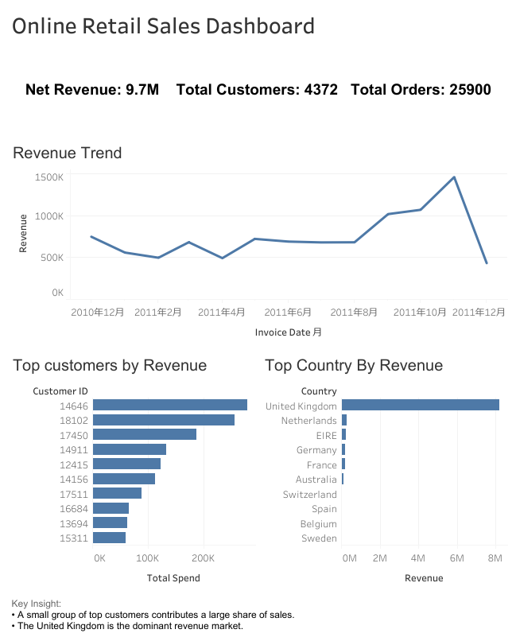

# Online Retail Sales Analysis Dashboard

## Project Overview
This project analyzes online retail transaction data to identify revenue trends, top customers, and country-level sales performance. The dashboard was built using Tableau, with revenue calculated from unit price and quantity.

## Tools Used
- SQL
- Tableau
- SQLite / DB Browser for SQLite
- Excel/CSV

## Key Structure
- Overall Sales Overview
- Customer Value Analysis

## Overall Sales Overview
- Total Revenue
- Total Orders
- Total Customers
- Monthly Revenue Trend
- Top Customers by Revenue
- Top Countries by Revenue

## Customer Value Analysis
- Income distribution based on customer value
- Top 10 customer distribution
- Customer visit repetitiveness

## Key Insights
- The United Kingdom accounts for the majority of revenue.
- A small group of customers contributes a large share of total sales.

## Dashboard
[View Tableau Dashboard](https://public.tableau.com/views/OnlineRetailSalesAnalysis_17778017021460/Dashboard1?:language=zh-CN&:sid=&:redirect=auth&:display_count=n&:origin=viz_share_link)

\](<Dashboard 1.png>)
](DashBoard_ScreenShot.png)

## Data Source
Dataset: [Online Retail dataset from Kaggle](https://www.kaggle.com/datasets/ulrikthygepedersen/online-retail-dataset)